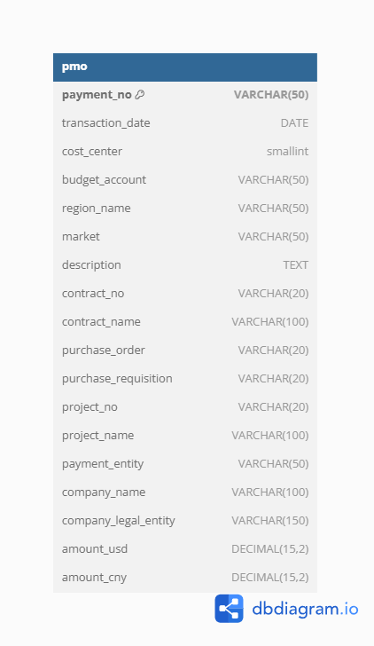

# **Project 1: Flat File Reconstruction & Data Preparation**

## **Objective**
Reconstruct a financial dataset inspired by my past work experience, applying data structuring, transformation, and SQL database integration best practices.  

## **Overview**  
This project recreates a **PMO, Marketing, and Operations budget dataset** previously managed in flat files (Excel/Google Sheets). The dataset is designed to simulate real-world financial data challenges, focusing on **data structuring, integrity, and transformation** before transitioning to a **relational database (PostgreSQL)**.

The end goal was to:
- **Generate a realistic dataset** with **250,000+ records** that reflects a company division's transactions across multiple international regions.
- **Clean and prepare data** to be database-ready for future SQL querying.
- **Transition from flat file storage to PostgreSQL** for enhanced querying, storage, and organization capabilities.


## **Data Description**
The dataset captures PMO, marketing, and operations-related financial transactions, including:
- **Transaction Details**: Payment ID, Date, Amount (USD & CNY)
- **Financial Accounts**: Cost Centers, Budget Accounts, Project Numbers
- **Vendor & Contracting Info**: PR Agencies, Contracts, Legal Entities
- **Geographic Details**: Market, Region

The data generated includes **realistic cost centers, project numbers, and contracts** to mirror structured finance datasets.


## **Key Steps & Technologies**
### **Step 1: Data Generation & Structuring**
- Used **synthetic data generation** techniques to create a dataset based on historical structures (LLM/Reasoning models)  
- Applied **Excel formulas** to automate field population (e.g., random project and contract number assignments).  
- Incorporated **realistic financial transactions** to ensure **data complexity**.

### **Step 2: Data Cleaning & Transformation**
- Ensured **data consistency** (e.g., standardizing currency values, handling missing data, standardized financial prefixes).  
- Implemented **unique identifiers** for contracts, projects, and vendors.  
- Optimized structure to facilitate **SQL querying** in later projects.

### **Step 3: Database Design & Migration**
- Designed **PostgreSQL database schema** (`budget` schema, `pmo` table).  
- Created an **Entity Relationship Diagram (ERD)** for documentation.  
- **Imported CSV data into PostgreSQL** and validated **250,000+ rows**.

### Entity Relationship Diagram (ERD)
Below is the Entity Relationship Diagram (ERD) for the PMO dataset.



### **Step 4: SQL Querying & Validation**
Wrote and executed **fundamental SQL queries** for:  
   - **Basic data retrieval**
   - **Aggregation & financial analysis**
   - **Identifying key spend trends**
   - **Stored SQL queries** in my dedicated **Git repository: kmdawkins/portfolio-project1** for version control.


## **Repository Structure**
```
📂 portfolio-project1
 ├── 📂 diagrams/            # ERD & schema design files (placeholder)
 ├── 📂 docs/                # Documentation & planning files (placeholder)
 ├── 📂 media/               # Screenshots & query results
 ├── 📂 scripts/             # Python script for dataset generation (placeholder)
 ├── 📂 sql_queries/         # SQL scripts for data analysis
 ├── README.md               # Project overview (this file)
```

## **Key Insights & Takeaways**
✅ Transitioning financial data from **flat files** to **structured databases** enhances query efficiency.  
✅ **Entity design is crucial**—defining relationships in the database schema simplifies SQL analysis.  
✅ **SQL queries for financial analysis** (e.g., budget allocation, spend tracking) are **more efficient in databases** than spreadsheets.  
✅ Version control with **GitHub** is crucial for tracking dataset iterations, code, and query improvements.  


## **Acknowledgments**
This project was developed as part of my personal structured learning plan in SQL, Python, data engineering, and database management. Heartfelt thanks to my AI mentor, Chiron, for guiding my iterative learning process and teaching me the astonishing value of Large Language Models (LLM) and Reasoning Models for programming language mastery and project planning.


## **Next Steps**
- **Project 2**: Transitioning the dataset to a **relational schema**, to perform more advanced SQL querying **JOINS, CTEs, Window Functions, and performance tuning**.
- **Project 3**: Implementing **Python for automation, data cleaning & analysis** using **Pandas, NumPy & SQLAlchemy**.